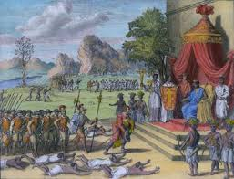
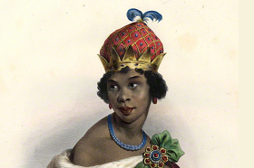
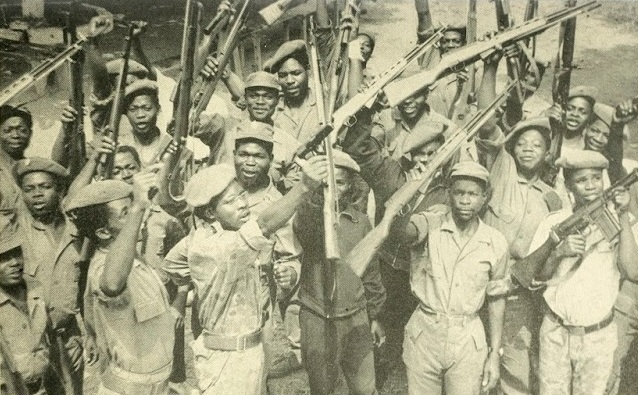
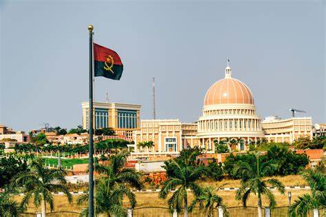

<html lang="pt">
<head>
  <meta charset="UTF-8">
  <meta name="viewport" content="width=device-width, initial-scale=1.0">
  <meta name="description" content="Site educativo sobre a história de Angola com informações sobre os períodos pré-colonial, colonial, independência e pós-independência.">
  
</head>
<body>
  <header>
    <h1 id="titulo">História de Angola</h1>
    <nav>
      <ul>
        <li><a href="#pre-colonial" id="nav1">Pré-Colonial</a></li>
        <li><a href="#colonial" id="nav2">Colonial</a></li>
        <li><a href="#independencia" id="nav3">Independência</a></li>
        <li><a href="#pos-independencia" id="nav4">Pós-Independência</a></li>
      </ul>
    </nav>
    

      <label for="idioma" style="color: #FFD700;">Mudar de idioma:</label>
      <select id="idioma" onchange="mudarIdioma(this.value)">
        <option value="pt">Português</option>
        <option value="en">Inglês</option>
        <option value="fr">Francês</option>
        <option value="es">Espanhol</option>
      </select>
    

  </header>

  <section id="pre-colonial">
    <h2>Período Pré-Colonial</h2>
    
    
Antes da chegada dos colonizadores, Angola era habitada por diversos grupos étnicos com estruturas sociais, políticas e económicas próprias. Reinos como o do Congo, Ndongo e Lunda tinham sistemas de governo organizados e culturas ricas.

  </section>

  <section id="colonial">
    <h2>Período Colonial</h2>
    
    
A colonização portuguesa iniciou-se no século XV e intensificou-se nos séculos seguintes. Houve resistência por parte dos povos locais, mas Portugal consolidou o seu domínio, explorando recursos e impondo o seu controlo administrativo e cultural.

  </section>

  <section id="independencia">
    <h2>Independência</h2>
    
    
Angola conquistou a sua independência de Portugal a 11 de novembro de 1975, após anos de luta armada liderada por movimentos como o MPLA, FNLA e UNITA. A independência foi um marco importante, mas seguiu-se um longo período de guerra civil.

  </section>

  <section id="pos-independencia">
    <h2>Pós-Independência</h2>
    
    
Após o fim da guerra civil em 2002, Angola iniciou um processo de reconstrução nacional. Investimentos em infraestrutura, educação e saúde foram intensificados, embora desafios sociais e económicos ainda persistam.

  <section>
    <label for="curiosidade" id="curLabel">Escolha uma curiosidade:</label>
    <select id="curiosidade" onchange="verCuriosidade(this.value)">
      <option value="">-- Selecione --</option>
      <option value="https://pt.wikipedia.org/wiki/Economia_de_Angola" id="opt1">Economia de Angola</option>
      <option value="https://pt.wikipedia.org/wiki/Cultura_de_Angola" id="opt2">Cultura de Angola</option>
      <option value="https://pt.wikipedia.org/wiki/Diamantes_de_sangue" id="opt3">Diamantes em Angola</option>
    </select>
  </section>

  <footer>
    &copy; 2025 História de Angola. Todos os direitos reservados. 
    Desenvolvido por: Silvia Simão, Silvina Martins, Simone Zua, Deblá Benjamin. Instituto Médio Comercial de Luanda, 12ª Classe, Curso de Informática de Gestão.
  </footer>

  
</body>
</html>

   
  
     
