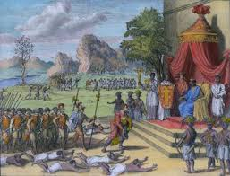
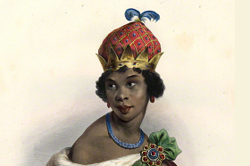
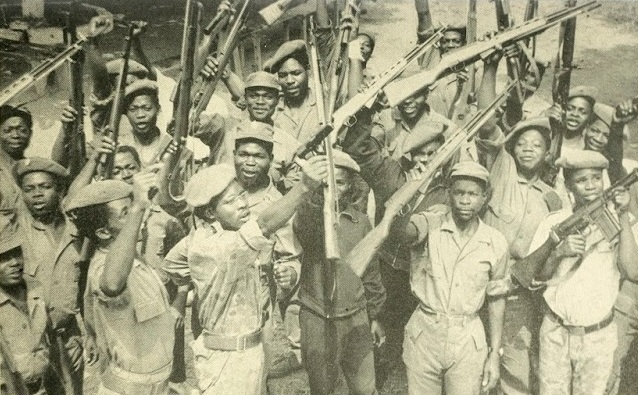
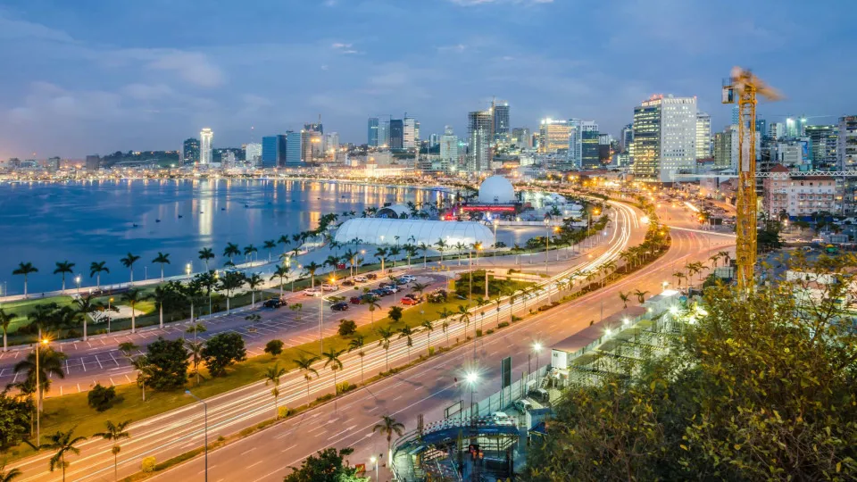

<html lang="pt">
<head>
  <meta charset="UTF-8">
  <meta name="viewport" content="width=device-width, initial-scale=1.0">
  <title>História de Angola</title>
  
</head>
<body>
  <header>
    <h1 id="titulo">História de Angola</h1>
    <nav>
      <ul>
        <li><a href="#pre-colonial" id="nav1">Pré-Colonial</a></li>
        <li><a href="#colonial" id="nav2">Colonial</a></li>
        <li><a href="#independencia" id="nav3">Independência</a></li>
        <li><a href="#pos-independencia" id="nav4">Pós-Independência</a></li>
      </ul>
    </nav>

    

      <label for="idioma" style="color: #FFD700;">Mudar de idioma:</label>
      <select id="idioma" onchange="mudarIdioma(this.value)">
        <option value="pt">Português</option>
        <option value="en">Inglês</option>
        <option value="fr">Francês</option>
        <option value="es">Espanhol</option>
      </select>
    

  </header>

  <section id="pre-colonial">
    <h2 id="preTitulo">Angola Pré-Colonial</h2>
    
    
Antes da chegada dos colonizadores, Angola era formada por reinos bem organizados, como o Reino do Kongo, Ndongo e Lunda. Esses reinos possuíam sistemas políticos próprios, comércio interno e externo, e uma cultura rica baseada em tradições orais, agricultura e mineração.

  </section>

  <section id="colonial">
    <h2 id="colTitulo">Período Colonial</h2>
    
    
Durante a colonização portuguesa, os recursos naturais e os povos de Angola foram explorados. Surgiram diversas formas de resistência, como a luta da Rainha Nzinga, que é símbolo de coragem, diplomacia e defesa da soberania do seu povo frente à opressão europeia.

    <a href="https://pt.wikipedia.org/wiki/Nzinga_de_Mbandi" target="_blank" class="curiosidade-link" id="linkNzinga">Saiba mais sobre a Rainha Nzinga</a>
  </section>

  <section id="independencia">
    <h2 id="indTitulo">Luta pela Independência</h2>
    
    
Com o tempo, movimentos de libertação como o MPLA, FNLA e UNITA organizaram-se para conquistar a independência. Após anos de luta armada e resistência popular, Angola tornou-se independente em 11 de Novembro de 1975, tornando-se uma república soberana.

  </section>

  <section id="pos-independencia">
    <h2 id="posTitulo">Angola Pós-Independência</h2>
    
    
Depois da independência, o país enfrentou uma longa guerra civil. Nos últimos anos, Angola tem investido no desenvolvimento de infraestruturas, educação e saúde. A reconstrução nacional é um esforço contínuo que reflete a força e a resiliência do povo angolano.

    <label for="curiosidade" id="curLabel">Escolha uma curiosidade:</label>
    <select id="curiosidade" onchange="verCuriosidade(this.value)">
      <option value="">-- Selecione --</option>
      <option value="https://pt.wikipedia.org/wiki/Economia_de_Angola" id="opt1">Economia de Angola</option>
      <option value="https://pt.wikipedia.org/wiki/Cultura_de_Angola" id="opt2">Cultura de Angola</option>
      <option value="https://pt.wikipedia.org/wiki/Diamantes_de_sangue" id="opt3">Diamantes em Angola</option>
    </select>
  </section>

  <footer>
    
Site criado por Silvia Sina, Silvina Martins, Simone Zua e Deblá Bejamim - 12ª Classe - IMCL

  </footer>

  
</body>
</html>

