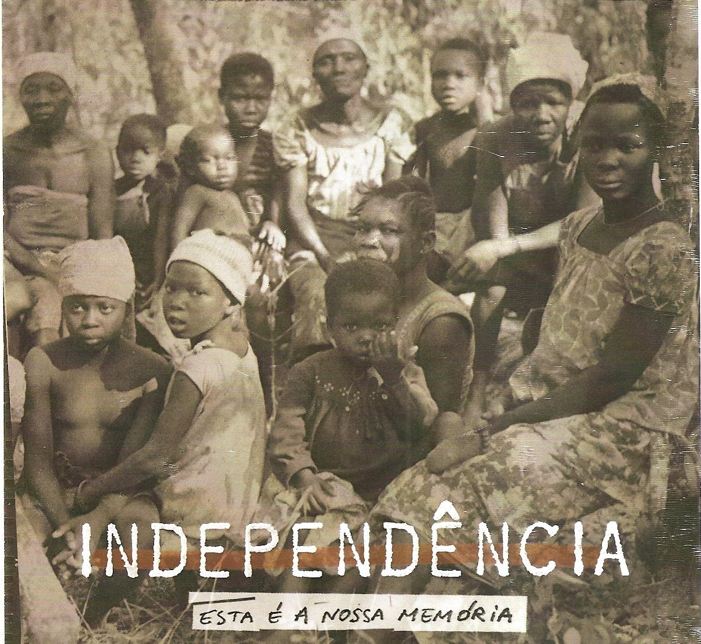

<!DOCTYPE html>
<html lang="pt">
<head>
  <meta charset="UTF-8">
  <meta name="viewport" content="width=device-width, initial-scale=1.0">
  <title>História de Angola</title>
  
</head>
<body>
  <header>
    <h1>História de Angola</h1>
    <nav>
      <ul>
        <li><a href="#pre-colonial">Pré-Colonial</a></li>
        <li><a href="#colonial">Colonial</a></li>
        <li><a href="#independencia">Independência</a></li>
        <li><a href="#pos-independencia">Pós-Independência</a></li>
      </ul>
    </nav>
  </header>

  <section id="pre-colonial">
    <h2>Angola Pré-Colonial</h2>
    
    
Antes da chegada dos colonizadores, Angola era formada por vários reinos como o Reino do Kongo, Ndongo e Lunda. Esses reinos tinham sistemas organizados de governo, comércio e cultura.

  </section>

  <section id="colonial">
    <h2>Período Colonial</h2>
    
    
Durante o período colonial, Portugal ocupou o território angolano, explorando os recursos naturais e a mão de obra local. Heróis como a Rainha Nzinga e Mandume lutaram bravamente contra a colonização.

    <a href="https://pt.wikipedia.org/wiki/Nzinga_de_Mbandi" target="_blank" class="curiosidade-link">Saiba mais sobre a Rainha Nzinga</a>
  </section>

  <section id="independencia">
    <h2>Luta pela Independência</h2>
    
    
O povo angolano lutou durante muitos anos pela liberdade. Em 11 de Novembro de 1975, Angola tornou-se independente graças ao esforço de movimentos como o MPLA, FNLA e UNITA.

  </section>

  <section id="pos-independencia">
    <h2>Angola Pós-Independência</h2>
    
    
Após a independência, o país passou por uma guerra civil longa, mas hoje caminha rumo ao desenvolvimento com foco na educação, saúde e infraestrutura.

  <section>
   <button onclick="mostrarCuriosidade()">Clique para ver uma curiosidade</button>
  </section>
  <footer>
    
Site criado por Silvia Sina, Silvina Martins, Simone Zua e Deblá Bejamim - 12ª Classe - IMCL

  </footer>
</body>
</html>
